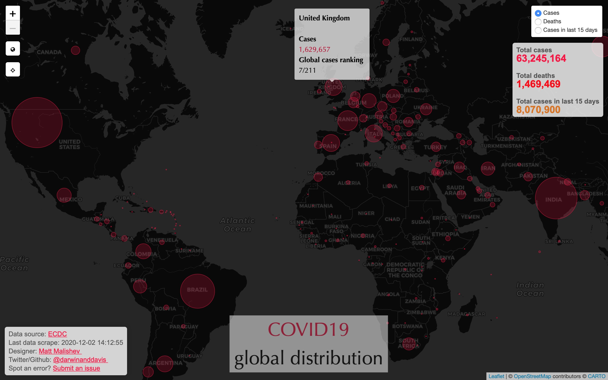
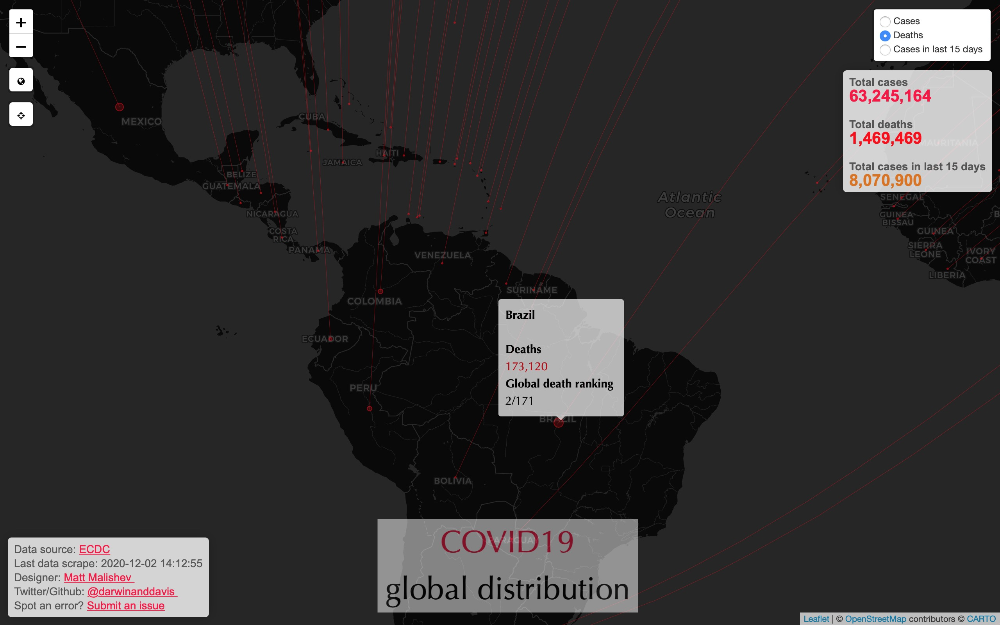
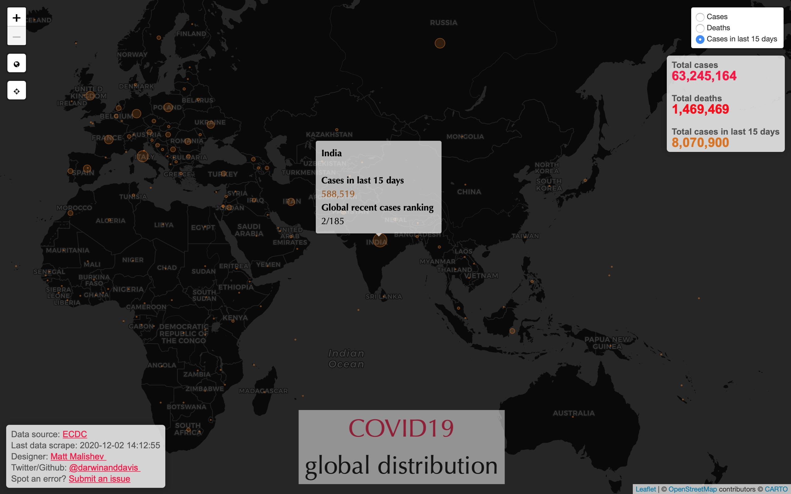

<!-- --------------------------------------------- -->
<!-- rmd settings -------------------------------- -->

<!-- equation rendering -->
<script type="text/x-mathjax-config">
  MathJax.Hub.Config({ TeX: { equationNumbers: {autoNumber: "all"} } });
</script>

```{r, set-options, echo = F, cache = F}
options(width=100)
knitr::opts_chunk$set(
 eval = F, # run all code
 echo = T, # show code
 comment = "",
 tidy.opts=list(width.cutoff=100), # set width of code chunks
 tidy = T, # make output as tidy
 message = F,  # mask all messages
 warning = F, # mask all warnings 
 size="small", # set code chunk size
 knitr::opts_chunk$set(fig.pos = 'H')
)
# rmarkdown::render_site() # render entire site
```

<!-- --------------------------------------------- -->
<!-- begin doc -------------------------------- -->

\newpage  

******      

Date: `r params$date`  
Email: `r params$email`  
Github: `r params$github`  

## Tasks

Build an interactive map of COVID19 coronavirus global distribution using daily data from the European Centre for Disease Prevention and Control (ECDC). The data used in the analysis are country level data of current active cases, deaths, and new cases within the last two weeks. Users can switch among these components as interactive layers in the map. Hovering or clicking on data points reveals the current numbers for the active layer, as well as the country's global ranking for the selected data layer.  

Data are webscraped daily from the ECDC site, then wrangled, analysed, and mapped in `R`, so data remain public and no internal databases are stored. 

## Files  
`ecohealth.Rproj` - `R` project file for maintaining code and generating this document       
`ecohealth.R` - `R` code for scraping, analysing, and mapping the data   
`cv_lonlat.csv` - Georeferenced latitude and longitude centroids by country. Generated from `ecohealth.R`.         

Data files and map are version controlled and stored on Github and the map is displayed as a separate link for easy sharing (see below).          

See the **Process** tab for full code walkthrough and to download the `R` code file.     

## Outcomes  

### [Click for full interactive map](https://darwinanddavis.github.io/worldmaps/coronavirus.html)        

\  

#### Global cases per country  

\   

#### Global deaths per country      
    

\    

#### Global cases in the last 15 days per country    
    
